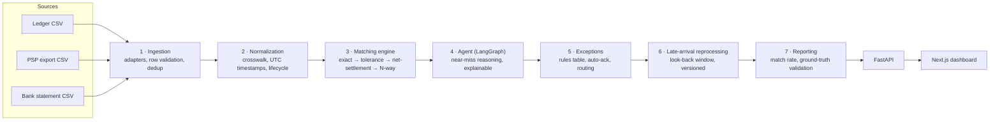

# Multi-Source Finance Reconciliation

Reconciles transactions across a **ledger**, a **PSP (payment processor) export**, and a **bank statement** —
three sources, three formats, no shared ID — matching what agrees automatically, resolving near-misses with an
AI reasoning layer, and routing only the genuine exceptions to a human.

Live demo flow: **[the problem](#the-problem)** → **[the solution](#the-solution)** → **[architecture](#architecture)** → **[running it](#running-it-locally)**.

---

## The problem

Same transaction, three different records. From this project's own dataset:

| Field | Ledger | PSP export | Bank statement |
|---|---|---|---|
| id | `LDG-9002` | `pay_H002` | `NEFT-9002` |
| amount | 1899.00 | 1899.00 | 1899.00 |
| counterparty | `Razorpay Technologies` | `RZP_MERCHANT_881` | `RAZORPAY SETTLEMENT REF9109` |

Same payment, same day, same amount — three completely different spellings of the counterparty, and nothing
forcing them to agree. That's one example out of a whole catalog of ways real financial data disagrees with
itself:

- **Timezones** — one source logs `18:30 IST`, another logs `13:00 UTC`, for the exact same instant.
- **Blank fields** — a currency column left empty on an otherwise-perfect match.
- **Net settlement** — 5 ledger rows + 5 PSP rows arrive at the bank as a single credit, net of fees.
- **Late arrivals** — a bank confirmation that posts a week after the transaction it confirms.
- **Silent fee bugs** — a bank credit that's short by exactly the processing fee, for no stated reason.
- **Data-entry errors** — a sale entered with a negative amount, which is *not* a near-miss and should never be
  waved through just because it's plausible-looking.

Doing this by hand means opening three tabs, sorting by date, and manually deciding which rows are really the
same transaction. At 67 rows that's an afternoon. At 67,000 it's a team — and the cases above are exactly the
ones that slip past a tired reviewer.

## The solution

An automated pipeline that ingests all three sources, matches what it confidently can, and hands off — with a
stated reason — anything it can't:

- **67** transactions processed
- **~79%** matched automatically, no human involved
- **5** genuine exceptions left for a person, each with a reason and a suggested owner (`engineering` /
  `finance_ops`)
- **20/20** known edge-case scenarios verified against an automated ground-truth check — not hand-verified

The two-page frontend walks through exactly this: **`/`** visualizes the problem with real records from the
dataset, **`/solution`** is the working dashboard — match-rate summary, a sortable/filterable exceptions table,
a click-through detail view with the raw record from each source side by side, and an acknowledge action that
writes back through the real API.

## Architecture

Seven backend phases, run in order, each independently unit-tested against the same synthetic dataset:



| Phase | What it does |
|---|---|
| **1. Ingestion** | Source-specific adapters for each CSV; bad rows are flagged with a reason, never dropped; SHA-256 dedup catches exact re-deliveries. |
| **2. Normalization** | Every timestamp converted to UTC; counterparty strings resolved through a crosswalk table; lifecycle state (`initiated` → `settled`) derived per source. |
| **3. Matching engine** | Five sequential passes, cheapest first: exact match, tolerance match, a balance sanity check, many:1 net-settlement batching, and N-way quorum. |
| **4. Agent (LangGraph)** | Runs only on what's left. A small state graph classifies each near-miss and routes to a dedicated resolver — infer a missing currency, accept a settlement-delay drift, close a crosswalk gap, net a refund against its original — or explicitly declines and says why (e.g. refuses to force-match a negative amount that's a genuine data error). |
| **5. Exceptions** | Whatever the agent won't touch becomes an exception, classified and routed through an editable rules table (`RULE-001`…`RULE-005`) — auto-acknowledge small known diffs, route fee bugs to engineering, route orphans to the right team by source. |
| **6. Late-arrival reprocessing** | A look-back window catches records that arrive after their match group already closed, revises the specific affected group, and versions it — the original version is never overwritten. |
| **7. Reporting** | Computes match rate and unresolved-exception listing; a separate validation script diffs the pipeline's actual output against `ground_truth.csv`'s 20 known scenarios, automatically. |

**Backend:** Python, FastAPI, SQLAlchemy, SQLite, LangGraph.
**Frontend:** Next.js (App Router), React, Tailwind CSS.

No external LLM call is made anywhere in the agent — with no model credentials configured for this build, "reasoning" is an explicit, inspectable chain of judgment calls per case (see `backend/agent/reasoning.py`), each documented with *why* it resolves or declines. Swapping a resolver's body for a real LLM call is a local change, not a redesign.

### Project structure

```
data/                    the 3 source CSVs + ground_truth.csv
backend/
  ingestion/              phase 1
  normalization/          phase 2
  matching/               phase 3
  agent/                  phase 4 (LangGraph)
  exceptions/             phase 5
  reprocessing/           phase 6
  reporting/              phase 7
  tests/                  one file per phase
  main.py                 FastAPI app
frontend/
  app/                    problem page (/) + solution dashboard (/solution)
  components/             SummaryCards, ExceptionsTable, ExceptionDetailPanel, TopNav
  lib/api.ts              typed API client
```

---

## Running it locally

Two terminals: one for the backend, one for the frontend. Leave both running.

### 1. Backend

```bash
cd backend
python3 -m venv ../.venv        # first time only
source ../.venv/bin/activate
pip install fastapi "uvicorn[standard]" sqlalchemy pytest langgraph pydantic httpx   # first time only

rm -f recon.db                  # start from a clean database
uvicorn main:app --reload --port 8000
```

Wait for `Application startup complete.` — on first run this also seeds the database and runs the full
pipeline automatically. Verify it's up:

```bash
curl -s http://localhost:8000/api/report | python3 -m json.tool
```

### 2. Frontend

In a second terminal:

```bash
cd frontend
npm install                     # first time only
npm run dev
```

Open **http://localhost:3000** — the problem page. Click through to `/solution` for the dashboard.

> The project folder name contains a space, so always quote the path when `cd`-ing into it, e.g.
> `cd "/path/to/multi_source ai_finance_recon/backend"`.

### Running the tests

```bash
cd backend
source ../.venv/bin/activate
python -m pytest tests/ -v
```

51 tests, one file per phase, run against the real dataset — no mocks.

### Validating against ground truth

```bash
cd backend
PYTHONPATH=. python3 reporting/validate.py
```

Diffs the pipeline's actual output against all 20 scenarios in `data/ground_truth.csv` and reports pass/fail
per story — this is the project's real test suite, not a hand check.

---

## API

| Endpoint | Purpose |
|---|---|
| `GET /api/report` | Match rate, status counts, unresolved exceptions |
| `GET /api/exceptions` | List exceptions (filter by `status`, `type`) |
| `GET /api/exceptions/{id}` | Exception detail + raw record from each source |
| `POST /api/exceptions/{id}/acknowledge` | Acknowledge an exception |
| `GET /api/rules` / `POST /api/rules` | Read/edit the exception-routing rules table (API only — no UI by design) |
| `GET /api/match-groups/{id}/versions` | Full version history for a match group (API only) |
| `POST /api/reprocess` | Manually trigger late-arrival reprocessing |
| `POST /api/run-pipeline` | Reset and re-run the full pipeline from scratch |
